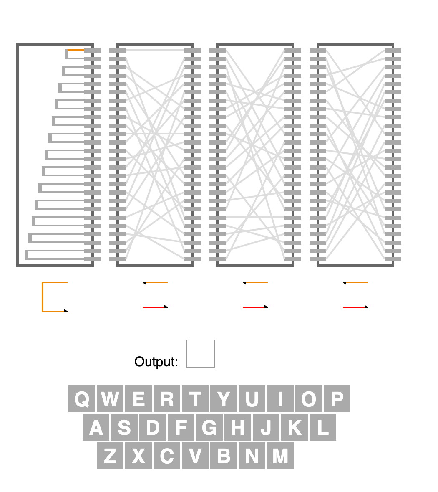
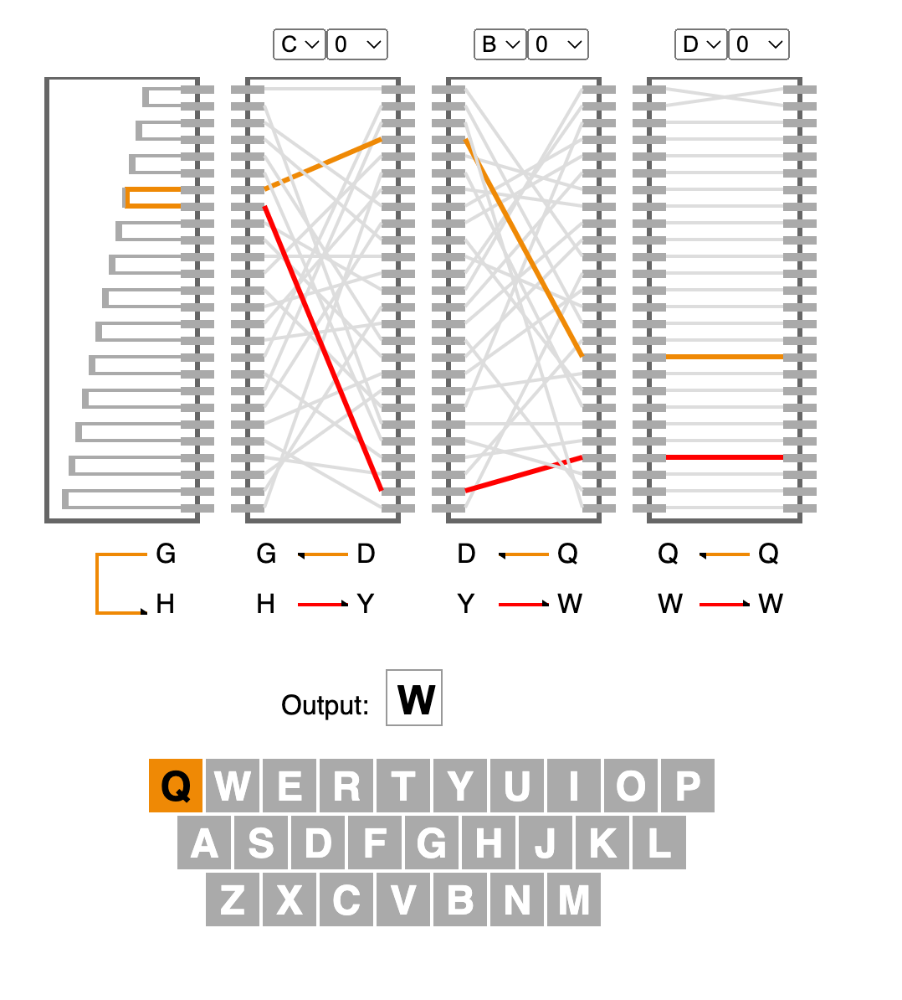
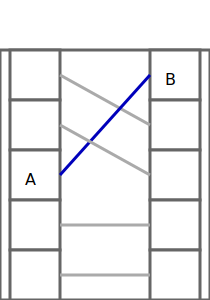
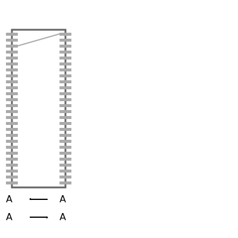

# Install Notes

$ npm install

$ npm start 

# Usage

This enignma machine is composed of three rotors shows as vertical columns and one reflector (the first column left to right). Initially the wiring diagram and transformations will look empty.

Input your message one character at a time using your mouse and the keyboard shown in the app. There are no backspaces nor punctuation right now.  

In this example, the first letter I clicked on was the letter Q.  The diagnostics are shown at the bottom of each rotor and start out right to left then through the reflector and back left to right. In this case, 

1. Q gets mapped to Z in rotor1 
2. Z is mapped to C in rotor 2 
3. C is mapped to S in rotor 3
4. S is mapped to T in the reflector
5. T is mapped to I in rotor 3
6. I is mapped to letter E in rotor 2
7. E is mapped to H in rotor1. 

As you click each key the input will be stored in the text box labeled "In" and the ciphered output will be stored in the next box labeled "Out:". In this first example, In = Q and Out = H. Adding more letters will add more to the In and Out text boxes.

Also note that as you input letters the rotor wire diagrams change (aka rotate). This is an important feature of an Enigma machine. 

To Decode the message, write down the Out message somewhere and refresh your browser. Then you can key in each letter of out to get the deciphered text. 

A good example is that MATTHEW gets encoded as FSBKBWN. Notice that the two T's get encoded as different letters and this is the advantage of a rotating cipher over a static cipher. In a standard substitution cipher T would always become a single letter (e.g. F). This variance of letter mappings makes it harder to decode a rotational cipher. 

# Problem

An [Enigma machine](https://en.wikipedia.org/wiki/Enigma_machine)  a cipher device used in the 20th century by Germany and its allies to protect communications. It operates via a set of 
 
0. The machine is configured according to a code book for a given time period. 
1. A keyboard: Upon which to input plain text messages. 
2. A set of rotors: On a key press, each rotor will encode an input character as an output and often these were stacked so letters went through multiple subsitutions. After the key is pressed, one or more of the rotors were rotated to change the encoding pathways. 
3. A reflector: This sends the character back through the rotors for another set of encodings. 
4. A plug board which enabled dynamic replacements (e.g. swap letter A for B. This can be done before or after using the rotors or both.
5. A alphabetic display which shows the corresponding encoded letter
6. This encoding is sent through communication channels (e.g. wireless)
7. One the recieving end, the machine is configured according to the code book and the encrypted message is typed in and decoded text shows on the alphabetic display. 

Here's a diagram from the Wikipedia link showing a wiring diagram. 

To explain the Enigma, we use this wiring diagram. To simplify the example, only four components of each are shown. In reality, there are 26 lamps, keys, plugs and wirings inside the rotors. The current flows from the battery (1) through the depressed bi-directional letter-switch (2) to the plugboard (3). The plugboard allows rewiring the connections between keyboard (2) and fixed entry wheel (4). Next, the current proceeds through the—unused, so closed—plug (3) via the entry wheel (4) through the wirings of the three (Wehrmacht Enigma) or four (Kriegsmarine M4 or Abwehr variant) rotors (5) and enters the reflector (6). The reflector returns the current, via a different path, back through the rotors (5) and entry wheel (4), and proceeds through plug 'S' connected with a cable (8) to plug 'D', and another bi-directional switch (9) to light-up the lamp.

We want to replicate this machine using [ReactJS](https://react.dev). 

# Softare Design

The basic data / state objects will be: 

- A mapping from 26 inputs to 26 outputs (rotors and plug board)
- Rotational state (which position each of the rotors are in) 
- Input and output streams 
- Possibly some sort of history so we can go back in state

# UI Design 
The UI elements will be the following so we can roughly match the diagram from wikipedia. 

 - A rotor
 - Plugboard
 - Keyboard (for output)
 - wires? 

## Rotors

There are a couple of basic rotor designs. 

The first is a focused version that would show 5 letters and what they transform into. In this case, A gets transformed into B by the rotor. 

The second option is more appealing to me and is based on a [Stanford Presentation](https://web.stanford.edu/class/cs106ax/res/lectures/12-Enigma.pdf) which I really liked. 

I like that this one has 26 inputs and outputs shown and there would be 25 more wire connects. The first grey bar would be A and the last one Z. This is simpler to render, shows the complexity of each rotor, allowus us to show the path and we can show the transformations based on both paths through the rotor.  

These are all based on simple SVG concepts like 

Rectangles 

    <rect  width="50" height="50" stroke="#666666" stroke-width="3"  fill="rgb(255, 255, 255)" x="10" y="50" />

Text elements 

     <text x="10" y="340">A</text> 

Polylines 

        <polyline points="30,77 , 100,57" style="fill:none;stroke:#aaa;stroke-width:2" />

## Keypads

The input keypad is a simple thing. It takes as input a string of characters and plot them in three rows reusing objects from the [tic-tac-toe tutorial](https://react.dev/learn/tutorial-tic-tac-toe). That gives the basic layout with some padding divs so that it looks a little more like a keyboard. Interestingly, in the 1940 model enigma machines there are no puncuation or spaces. 

Onclick events are handled the usual way to highlight the key and start the encoding. Output is displayed in a box.

# Data structures

## Rotors

Rotors are based on shuffles of integer arrays where A is mapped to 0 and Z is mapped to 25. 

    const letters = [0,1,2,3,4,5,6,7,8,9,10,11,12,13,14,15,16,17,18,19,20,21,22,23,24,25];

This allows us to quickly look up mappings from right to left (the initial way through the rotors) as we can use letters[0] to get the mapping for letter A. However, on the return trip we need to find the value within the list then map backwards. We could keep two of these arrays to help with lookups. 

    const rotor1 = [4,17,19,8,14,15,2,6,0,16,10,5,20,11,9,7,1,3,13,25,18,22,24,23,12,21]

In the above example, rotor1 maps A to E (0 to 4) but on return we need to look up 4 to get 0. This can be easily done at initialization to allow efficient lookups during the ciphering process. 

    const rotor1_inv = [8,16,6,17,0,11,7,15,3,14,10,13,24,18,4,5,9,1,20,2,12,25,21,23,22,19]

# Algorithm 

Alright, it's the fun part, let's cipher some text! This is really three major operations. 

0. Copy the value from the input or last rotor
1. Cipher the value according to lookup values (right to left direction)
2. Use the inverse of the cipher (easy version is a function but could be cached for a larger alphabet)

Heres the code snippet for Rotor1  

    nextRotorsIO1[0] = input_idx;
    nextRotorsIO1[1] = rotor1[nextRotorsIO1[0]];

    ...

    nextRotorsIO1[2] = nextRotorsIO2[3];
    nextRotorsIO1[3] = inverse_cipher(nextRotorsIO1[2],rotor1);

I also added some color highlighting to make the rotors pop from left to right. 

## Rotation - Simple Version

Next part is to start rotating the rotors after an input is ciphered. This involves some transformations. Let's say that the initial
configuration has the following ciphers in a rotor

    A <-> A
    Z <-> I 

Then we rotate one click for that rotor. The easiest way to do this is to say perform a pop/unshift pairing for the configuration string. 

    A <-> I 
    B <-> A 

## Rotation - Historical

The rotors in the historical one rotated in a similar way to the following example. 

    C <-> A (adding 2 letters to A)
    A <-> B (subtracting 1 letter from B)
    B <-> C (subtracting 1 letter from C)
    D <-> D (no change)

After a rotation the inputs & outputs on the right and left would change. You can visualize this as the transformations shifting one location on the rotor. For example, the no change transition would now be applied to the letter A while input B would get the 2 letter transformation applied. 

    A <-> A (no change) 
    D <-> B (adding 2 letters to B)
    B <-> C (subtracting 1 letter from C)
    C <-> D (subtracting 1 letter from D)
 
For this, you can inefficently calculate the transformation vector. For example, if the first transformation adds 2 letters to the input A then when the wheel shifts input B will have two letters added to it. That means creating the transformation vector, shifting it one place and then recomputing the cipher vector. We have to add a constant (3*26) that is a multiple of the alphabet to handle negative transformations (e.g. subtract 1 letter from the input).

  //mechanical representation. 
  //create the transformation vector 
  newrotor = newrotor.map((v,i) => {
    return v - i;
  });
  
  //shift the entries
  newrotor.unshift(newrotor.pop());

  //create the new mapping
  newrotor = newrotor.map((v,i) => {
    return (i + v + (3*26))%26;
  }); 
